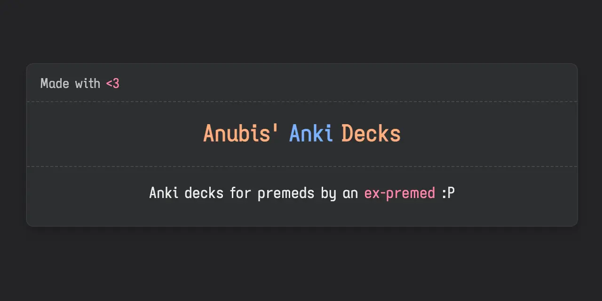
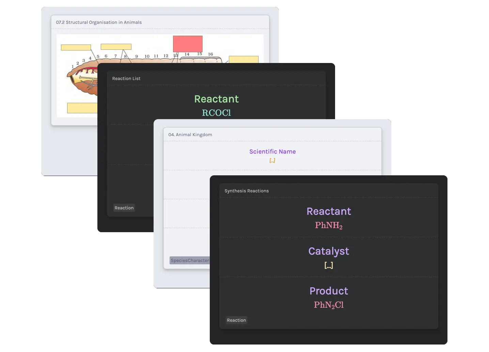

# Anubis' Anki Decks

<h3 align="center"><a href="https://github.com/AnubisNekhet/AnkiDecks/blob/main/Decks/AnubisDeckPenultimate.apkg?raw=true">Download Link</a></h3>

### Progress
Subject | Version | Scope | Cards
:---: | :---: | :---: | :---:
Entire NEET Syllabus | 2.1.0 | NCERT + Aakash (Partial) | 10k

## Progress
Almost all of NCERT done save for very few lines that may be here and there. I'm no longer providing any dedicated updates to this deck.

### Updates
- [x] 21/4/22 - Minor Biology deck update for select chapters and formatting touch-ups
- [x] 30/3/22 - v1.0.1 of the shorthand chem deck, now with more reactions, unique style for synth reactions, a subdeck for reaction influencing groups.
- [x] 7/7/22 - Penultimate major update, I have included all the information I felt I needed to for my own preparation, feel free to message me if you would like some changes as I'm going to stop pushing updates soon.
- [x] 19/12/23 - Updated deck styling, open to any contributions

## Corrections/Errata
You can use [CrowdAnki](https://github.com/Stvad/CrowdAnki) to import the [deck.json](https://github.com/AnubisNekhet/AnkiDecks/blob/main/deck.json) and issue a pull request on cards that need to be corrected. I cannot manually change any errors since medschool hasn't left me with any free time, but feel free to make changes and keep deck updated to help future aspirants.

## Acknowledgements

[Pranav's Anki Prettify](https://github.com/pranavdeshai/anki-prettify) for these beautiful card styles.
[Catppuccin](https://github.com/catppuccin/catppuccin) for this amazing palette (They also have light mode too!)
